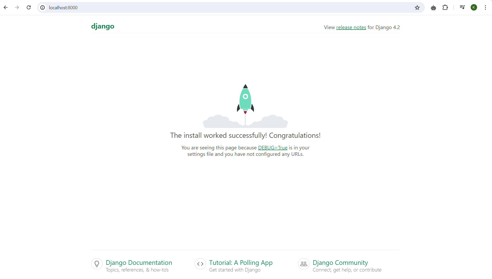

# Docker containerization Django App

**Prerequisites**

- Python
- Docker
- Git

## **Creating a Django project**

Create a new project called my_project.

```bash
$ django-admin startproject my_project
```

The directory structure of the project


After creating a new Django project, we can test it locally by running the development server. The development server is a simple web server that runs on our machine and serves our project files. To start the development server, run this command in terminal:

```bash
$ python manage.py runserver
```

## **Dockerizing the Django Project**

Dockerfile

```docker
FROM python:3.9

#Install Django and other required packages
RUN pip install django

# Copy the Django project files into the image
COPY . /app

# Set the working directory
WORKDIR /app

# Start the Django development server
CMD ["python", "manage.py", "runserver", "0.0.0.0:8000"]
```

Build the Dockerfile to Docker image

```bash
$ docker build -t . my-django-image:v1
```

Running Docker container

```bash
$ docker run -it --name Django-app -p 8000:8000 my-django-image:v1
```

Access the application on browser.

http://localhost:8000

